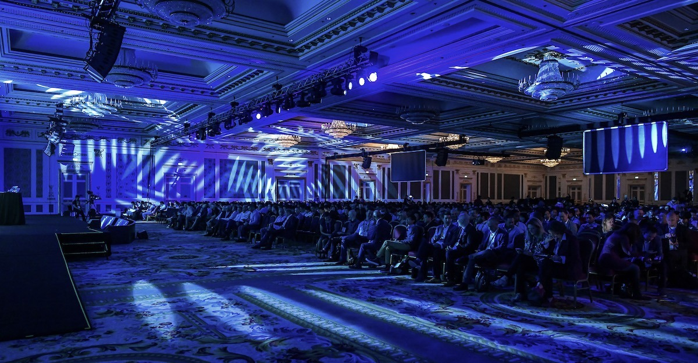
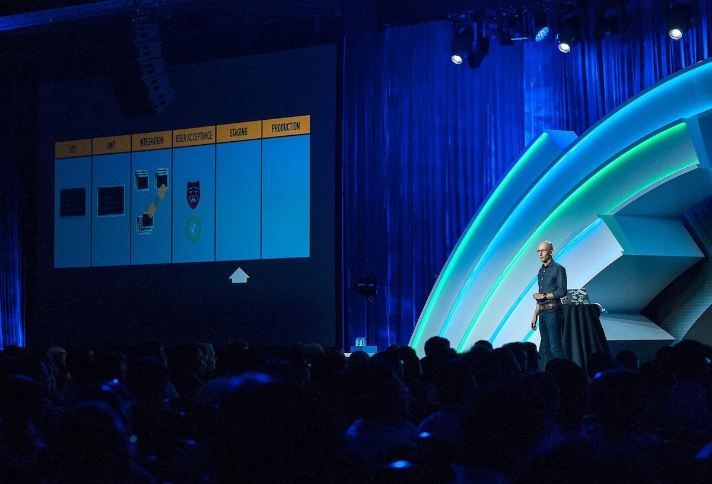
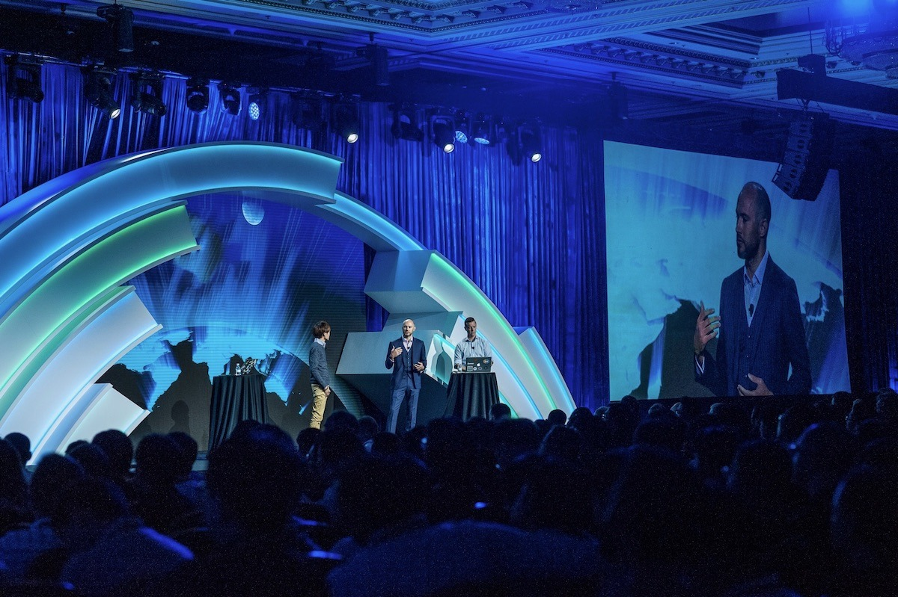
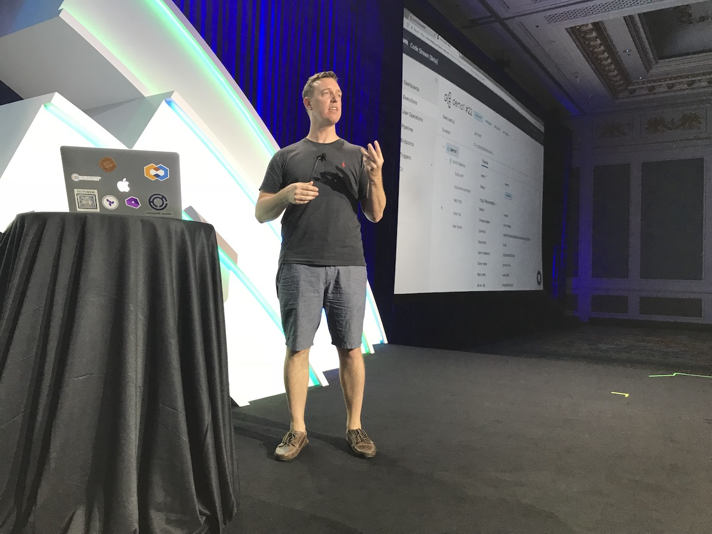
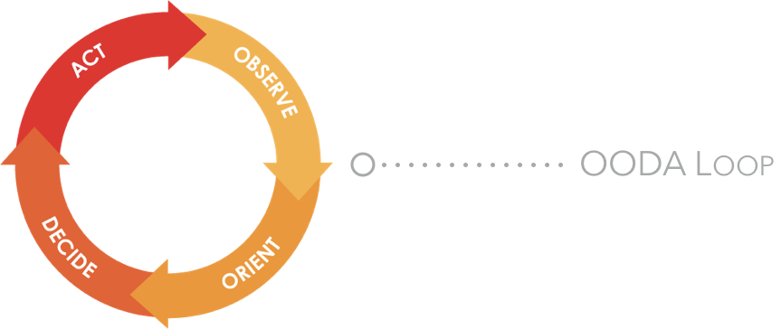
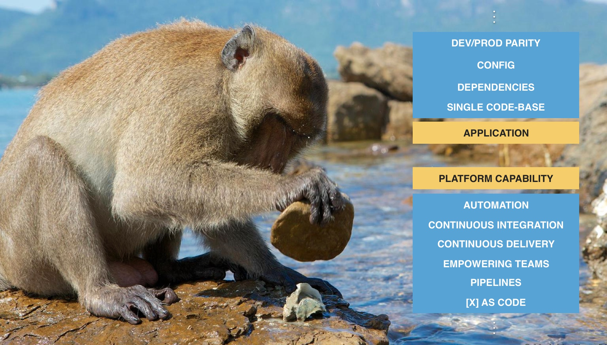
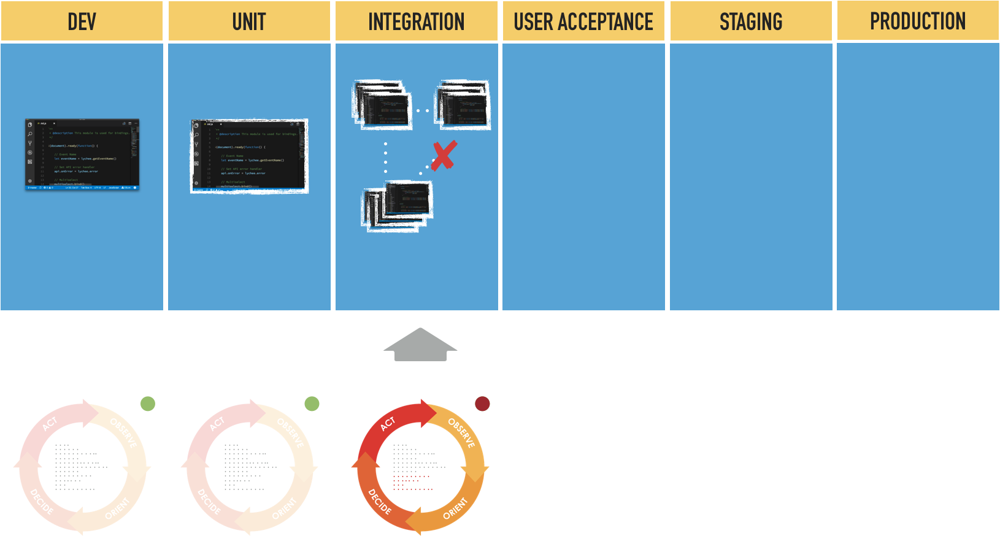
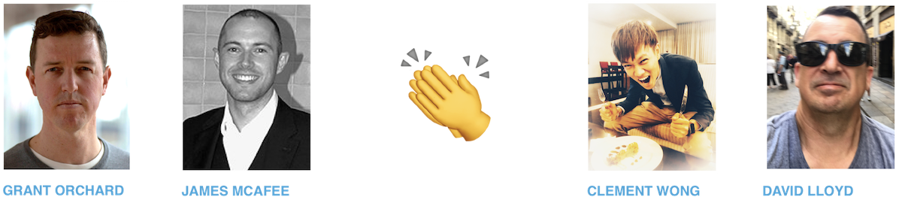

What works for brown-bag & "throw your screen up"-type demo-versations does not always translate onto a stage in front of hundreds & thousands of people.

Together with some brilliant technologists earlier this year, we had the privilege of showcasing VMware's ability to enrich and accelerate the app development lifecycle at our yearly TechSummit's Keynote.

> What constitutes steps _towards_ a half-decent technical demo ?

Arguably many of the below thought spurs can and should be applied to smaller spaces and any presentation. Yet the 'theatre' on the stag necessitates considerations which in some case make it difficult to impossible to compare to its coffee table or Meetup brethren.

# Feedback from the room

Outside of few, very vocal seated individuals, there is little presenter-audience interaction.

The near blinding flood-lit stages, although at first disorienting - they do a great job of disconnecting you from the audience. And if executed well, provide the feeling of being alone on that stage; great for those with nerves 👋, but not so good for getting body language queues from the audience. Especially since you're no longer presenting to individuals but to a single crowd.

You cannot compress preparation time. Rehearse, rehearse, rehearse, yet be cautious of balancing the content rehearsal, without maiming the personalities. As with all presentations .. do enjoy them.

Validate the entire run-through with those :

- In the auditorium that are able to provide some honest and pointed course correction. Have them sit and provide feedback, whether they follow your story-line and and aren't getting dizzy with scrolling confused with all the window changes.
- That are colourblind
- That represent your target audience - ie technologists, to validate the narrative so you can do any necessary fine tuning

# Dress the content for the room

Dark or white background, typeface selection to match eligibility, aesthetics and again - intended audience. Be cautious and selective about each, and screen whether each window and click is aiding the immediate narrative and goal of the presentation.

# CLI & Shell Demonstrations

Aside from this being a topic deserving its own post, you should  need a really GOOD reason to dive into command-line during a presentation - and it better be legible. What is a simple scroll on your screen, translates to terminal velocity at a distance.

> Upon typing a number of commands - the output will dominate the screen as the cursor is now at the bottom. Ask - are those in the back still able to see what you are narrating ? Try and keep to 1–2 commands per terminal screen invocation. `CTRL + L` is your friend here.

Later in the day, during lunch - I had a Solutions Architect from the US, thank me for using the [same font](https://github.com/adobe-fonts/source-code-pro) whenever any `code` was shown on the screen. Wait - someone paid attention to that ?

From the slides, to the terminal to the text editor font size - the night prior, during ( our first rehearsal with all participants ), all of those were adjusted specifically to fit with the room, and the distance people would sit away from the screens. Perhaps a little 😅 OCD, but not only was the work justified after the comment from our stateside comrade, but these small, seemingly inconsequential changes and mannerisms make an enormous difference to helping people follow and understand what is being shown.

<figure>
  
  <figcaption>night before rehearsal | Grant - 'I have not slept for these many nights preparing this demo'</figcaption>
</figure>

# Challenge the Audience - with Respect

Paraphrasing [Bruce](https://www.linkedin.com/in/bruce-davie/)'s frequent advice to the team - 'do not forget the origins'. Effectively - try, and design the presentation flow with an explanation of the fundamentals first.

We often fall prey to our own wishes to push forward, and dig into the _perceived_ most exciting, important and relevant topics, only to discover that we left the audience at a disadvantage. Name the changes, highlight the shift, and always point out the **reason** of why significant & relevant changes enhance their world.

Only by explaining the history, will the majority be able to truly appreciate and respect the delta of any advances.

# Limit the Scope & Focus

"Would it not be great if we could .. " was not a good start. One of the inherent limitations to larger stages is the time constraint of making sure you finish on time. This requires the team to be able to say 'no' to many opportunities to add more material.

> Perfection is achieved, not when there is nothing more to add, but when there is nothing left to take away.

>  - Antoine de Saint-Exupery

James' pragmatism always brought us back to our focal area - "at the end of this session we wish to demonstrate" :

- **what** - pitfalls exist in a development process
- **how** -  an increasing level of feedback improves quality and project velocity
- **products** - across VMware's Software Defined Datacentre portfolio that can enable Application Platform Capabilities within an enterprise

<figure>
  
  <figcaption>a showcase of how to stop error propagation</figcaption>
</figure>

When a topic is dear to your heart, it is easy to go too deep or off on a tangent - especially with some over excited adrenal glands. This is where having gone through the rehearsals you create muscle memory of triggers for the story line and bring you back on point.

Whatever you do, try not to come up with an analogy on the spot that you think will resonate or humorous. // guilty

# Preparation | Live vs. Recorded
There comes a time ( hopefully early ) where you must decide whether you will be doing a live demonstration, narrating a recording or as with some 'click throughs' try and fake live usage.

Literally upon landing in Hong Kong, two days before showtime - David discovered that the entire environment around which we built the demos around has carked itself. After spending some time in debug mode ( read : laptop being taken to a bar ), it was decided to just redeploy the entire showcase to another provider all together. Given the flexibility today in defining everything through code from underlying infrastructure, to application infrastructure like Kubernetes deployments to entire CI / CD pipelines which include Wavefront Dashboards.. made the whole ordeal so much more manageable.

 - 

Erring on the side of a technical audience, and whenever am watching - I prefer to spend copious amounts of time preparing for live delivery over recorded. James - the voice of reason, asked for recorded demos to be available during the keynote, so at the very least, the night prior we did the screen captures.

# Wrap Up

The whole team travels quite a bit. It was not a dramatisation of us doing for the first time the complete physical rehearsal the night before. There were days we would hear nothing from some of the members, but when they came to the checkpoint meetings - they brought the goods. 
What this experience has taught me, through the ebbs and kicks of technological dependancies, relying on the right team that has a sense of purpose of what and why they're doing something - allows for exceptional experiences.

With that, an enormous THANK YOU to [James McAfee](https://www.linkedin.com/in/james-mcafee-38a3814b/), [Grant Orchard](https://www.linkedin.com/in/grantorchard/), [David Lloyd](https://www.linkedin.com/in/davlloyd/) and [Clement Wong](https://www.linkedin.com/in/clementw/) for delivering an outstanding session with many lessons that we can all take into the future.

# The Team

<figure>
  
  <figcaption>the team</figcaption>
</figure>

# References
- Macaque -[Mark MacEwen/NPL](http://www.4apes.com/de/news/item/1376-http-www-bbc-com-earth-story-20150818-chimps-living-in-the-stone-age-ocid-ww-social-link-twitter)
- OODA Loop - [D!gitalist](https://www.digitalistmag.com/cio-knowledge/2017/12/27/machine-learning-manufacturing-production-ooda-loop-05679010)