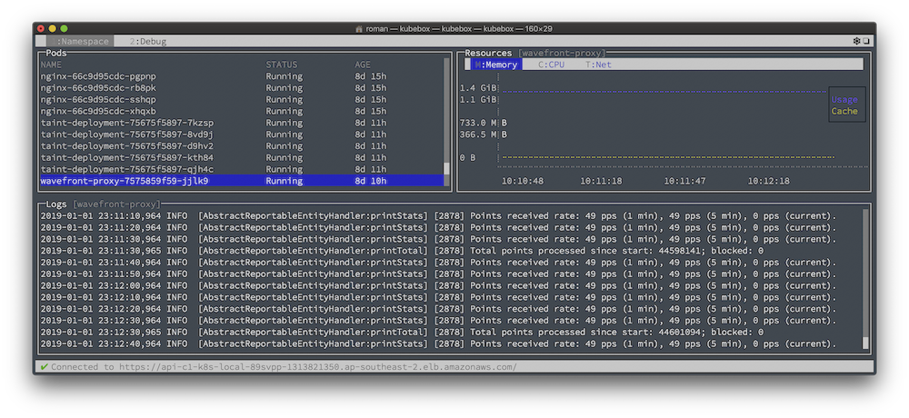



According to the blog's [first post]() - I began in 2007. Vast majority of the published ( and those that died in draft form ) were a result of trying to fix things I came upon, and the associated learnings: be it automating WebSphere deployment 😜 or a GPS logger's integration with Lightroom.

Here are a few new things I learnt week.

## Wordpress Migration 
I killed my WP hosting sometime in early '18, and just archived the content. Upon a number of conversations early on with [Grant](https://twitter.com/grantorchard) - I contemplated a conversion to Jekyll. But did not have the drive at the time to make the leap. So the WP archive to Jekyll '.md zip' sat there for ~6 months.

A few days ago over lunch I had a quick perusal of static generators, and their associated ecosystem trajectories. Picked Hugo as the path forward.

**The Good**

- Hugo's build, and validation is ⚡️ FAST, and Go's Templating Language reminds me of HandlebarsJS. Fact that Hugo has limited theming & customisations is a boon to focus and productivity
- Markdown everywhere 😍

**The ~~Broken~~ Still In Limbo**

- Hugo's Customisation
  - Alebit limited in themes and out of the box iintegrations ( a matter of time ) means in some instances like SEO, when you hit roadblocks - you have to design or add them yourself. Plus I really should have got the redirects sorted out prior to changing the structure
- Authoring Experience
  - Should not have match the quality, and fidelity of what Medium.com has created - but it has set the standard of what is possible in the browser for content creation and curation
- Decisions on Image optimisation
  - ie. LQIP, Progressive JPEG re-encoding
  - CDNs vs DAMs vs localised imagemagick
- LD-JSON content extension and integration
- Figuring out when to stop.. do I really need to write a custom Hugo shortcode to display Apple Watch HR data ?

## Netlify

Immediately upon stumbling across [Netlify](https://netlify.com), they piqued my interest. They have some notable pedigree from Github, Docker, Serverless but most importantly I love the user experience of their product: a streamlined barebones application platform. They have thought through the [landscape of customer demands](https://medium.com/netlify/how-netlifys-deploying-and-routing-infrastructure-works-c90adbde3b8d), competitors' ability, and are now navigating accordingly. Just when you started to think that application hosting, and delivery is a done deal with same set of tools throughout, Netlify re-applies the pattern atop a highly optimising storage, and service coupling back-end to provide a very differentiated out of the box experience. 

## tmux & Kubernetes

After an immersive week of Kubernetes deployments, and some [Wavefront](http://wavefront.com), it was starting to be a pain to easily monitor the K8s state whilst trying to script several scaling and failover scenarios. Constant Terminal.app switching was inevitable. Jetisoning my love of `screen` it was time to adjust.

After a little bit of prodding tmux with panels for logs, hosts, deployments, services .. ugh ..

or I could have just used [kubebox](https://github.com/astefanutti/kubebox) 🤷‍♂️



## Visualising Apple Health Data

### TL;DR Version

Add [chart.html](https://gist.github.com/romant/e7262a5b9e2f3b9e2bc0ac8c46a1282e) to your `layouts/shortcodes` folder.

Within your content use:

```js

```

### The Step-by-Step

After a quite poor run with [James](https://twitter.com/james65535), I decided to see how I went on the trusty phone, since Apple ⌚ tracks all movement. Quickly realised this is an opportunity for a post-dinner mini project.

Lets walk through how to create the headline graphic with [ChartJS](https://www.chartjs.org/) in Hugo.

### Get The Data

The team at [Test-Driven Data Analysis](http://www.tdda.info/in-defence-of-xml-exporting-and-analysing-apple-health-data) does an excellent job of showing how you can get the data off the watch, but most importantly convert it from XML to something more usable.

The fun starts once you have the CSVs.

Listing the generated `apple_health_export` at this point should present you with :

```c
1.3G export.xml
385M export_cda.xml
318M ActiveEnergyBurned.csv
189M BasalEnergyBurned.csv
140M DistanceWalkingRunning.csv
89M HeartRate.csv
72M StepCount.csv
17M AppleExerciseTime.csv
7.9M DistanceCycling.csv
4.1M FlightsClimbed.csv
397K HeartRateVariabilitySDNN.csv
79K SwimmingStrokeCount.csv
77K DistanceSwimming.csv
63K RestingHeartRate.csv
62K WalkingHeartRateAverage.csv
12K VO2Max.csv
5.3K convert.py
971B BodyMass.csv
940B UVExposure.csv
497B Height.csv
```

### Create the Hugo Chart JS Layout Shortcode

The inside of HeartRate.csv looks like this the following, multipled by hundreds of thousands of rows. So pick a subsection.

| sourceName | endDate | more | value
| :------------ | :-------------: | :-------------:| ------------: |
| Roman's Apple Watch      | 2015-05-22 13:05:21 +1100 | .. |       81 |
| Roman's Apple Watch      |    2015-05-22 13:43:56 +1100 | .. |         65 |

Charts themselves are quite straight forward, but you will need to map the data first

Recommended some dirty cut or awk magic, and cleanup if you're going to be sharing / exporting, as naturally it does have your Watch's identifier included.

Using lodash, map it to distinct `dataPoints`, and `labels` Arrays for injestion by ChartJS.

```js
data = $.csv.toObjects(response);
labels = _.map(data, 'endDate');
dataPoints = _.map(data, 'value');
```